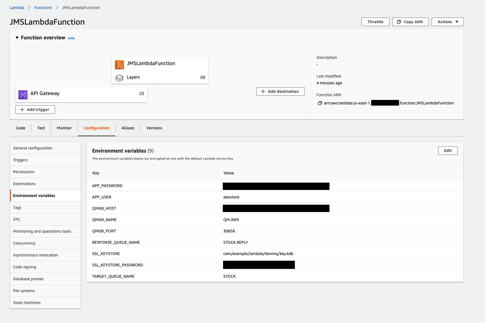

# Cross Cloud Stock Check Demo using MQ

An end to end scenario to demonstrate secure, reliable transmissions of data across multiple regions and cloud providers - for example IBM MQ on IBM Cloud in the UK and IBM MQ on AWS in the US


___

## Contents

**[About](#about)**

**[Getting started](#getting-started)**

**[Configuring two IBM MQ on Cloud queue managers](#configuring-two-ibm-mq-on-cloud-queue-managers)**

**[Setting up the AWS Lambda function](#setting-up-the-aws-lambda-function)**

**[Setting up the stock check backend JMS application](#setting-up-the-stock-check-backend-jms-application)**

**[Deploy Web UI](#deploy-web-ui)**

___

## About

This guide will cover the following;

1. Deploying and configuring two IBM MQ on Cloud queue managers
2. Deploying a JMS application to AWS Lamdba, connected to a queue manager in AWS
3. Running JMS application locally connecting to a queue manager in IBM Cloud
4. Deploy web application to invoke REST call and handle response from MQ.

Before you start, you will need the following:

- IBM Cloud Account
- AWS account

Please note the instructions in this guide are purely suggestions of how and where to deploy each component.

For example, you could also deploy the two IBM MQ queue managers to IBM Cloud only if you wished.

## Getting started

Clone the github repo with the following command

``` bash
git clone https://github.com/ibm-messaging/mq-cloud-demo
```

Now we must download the dependencies for our two JMS applications.

Install Gradle following this guide - [Installing Gradle](https://docs.gradle.org/current/userguide/installation.html").

Run the following commands to grab the depencies:

```bash
# AWS Lambda JMS Application
cd mq-cloud-demo/aws-backend-request/JMSLambdaFunction
gradle getDeps

# IBM Backend Response JMS Application
cd mq-cloud-demo/ibm-backend-response/jmsapp
gradle getDeps
```

Check that the following files exist along with various other dependencies in the following directories:

```sh
---
ibm-backend-response/jmsapp/jars/com.ibm.mq.allclient-9.0.4.0.jar
ibm-backend-response/jmsapp/jars/javax.jms-api-2.0.1.jar
---
aws-backend-request/JMSLambdaFunction/jars/javax.jms-api-2.0.1.jar
aws-backend-request/JMSLambdaFunction/jars/com.ibm.mq.allclient-9.0.4.0.jar
---
```

Once confirmed you can now continue on with the next step of this guide.

___

## Configuring two IBM MQ on Cloud queue managers

The first part of this guide will cover the following:

- Creating two IBM MQ on Cloud service instances.
- Creating two queue managers on cloud; one in IBM Cloud, and one on AWS.
- Creating application user permissions for connecting apps to both queue managers.
- Creating admin user permissions for managing both queue managers.

Follow these [instructions](./qm-config/README.md#configuring-two-ibm-mq-on-cloud-queue-managers) to setup two MQ on Cloud queue managers.

Once complete, return to this page to continue with the rest of the setup.

___

## Setting up the AWS Lambda function

Now you have configured both queue managers, we will now configure the backend JMS applications that will consume and produce messages.

The first of the two applications will be triggered by a REST api, simulating a customer stock check request, and produce a message that will be handled by a backend response, which will return a stock count for a given product.

### 2.1 Build Steps

1. Build the deployment zip:

    ```bash
    cd mq-cloud-demo/aws-backend-request/JMSLambdaFunction
    gradle build
    ```

2. Confirm the zip has been created, it will be found in the following directory:

    - `mq-cloud-demo/aws-backend-request/JMSLambdaFunction/build/distributions`

### 2.2 Creating an AWS Lambda Function

1. Go to the [AWS Lambda Console](https://console.aws.amazon.com/lambda/home?region=us-east-1).

2. Click `Create Function`.

3. Select `Author from scratch`.

4. Name the function JMSLambdaFunction

5. Select `Java 8` from the Runtime dropdown.

6. Under role, select `Create a custom role`, you will be taken to a new page, leave the values as default and click `Allow`.

7. Now click `Create function` and wait for the process to complete, you will be redirected to the Lambda Function configuration page.

### 2.3 Deploy Function code

1. In the `Configuration` tab, select the function `JMSLambdaFunction` from the designer. Scroll down the page to the `Function code` sub-section.

2. In this section, paste the following into the `Handler` field.

    ```bash
    com.example.lambda.ibmmq.JMSLambda::handleRequest
    ```

3. Click upload, navigate to `mq-cloud-demo/aws-backend-request/JMSLambdaFunction/build/distributions` and select `JMSLambdaFunction.zip`.

4. Now click `Save` at the top right of the page.

### 2.4 Set Environment variables

For this step, you will require the connection information for the AWS queue manager that you would have downloaded earlier from section 1 of this guide (hint: look for aws.json).

You will also require the application details and api key, which was downloaded in section 1 (hint: look for app.json).

With your function still selected, below the "Function code" section, there is another box entitled "Environment variables".

Add the following key / value pairs as environment variables.

| Variable Name |  Value |
| ------------- | ------ |
| APP_PASSWORD | <Your_Application_APIKey>
| APP_USER | <Your_Application_MQUsername>
| QMGR_HOST | <The_Hostname_Of_Your_Queue_Manager>
| QMGR_PORT | <Your_QM_Port>
| QMGR_NAME | <Your_QMGR_NAME>
| RESPONSE_QUEUE_NAME | STOCK.REPLY
| TARGET_QUEUE_NAME | STOCK

___

#### Screenshot of configured Lambda Function



___

### 2.5 Create API Gateway

Now we will add an API Gateway which will allow us to invoke the function using a simple HTTP REST call.

1. In the `Configuration` tab, within the `Designer` sub-section, click `API Gateway` from the left hand column.

2. Once added, under `Configure triggers`, from the API dropdown select `Create a new API`.

3. Under `Security` choose Open.

4. Click `Add`, and then click `Save` in the top right hand corner of the page.

5. This will create a new API Gateway named `JMSLambdaFunction-API`

    - You will now see an API endpoint has been generated, take note of this as we will need it later.

6. Click the name for the API Gateway to access its dashboard to configure it.

### 2.6 Configure API Gateway

Now we must configure and deploy the API we have just created.

1. Now in the API Gateway dashboard, find your new API in the left-hand APIs navbar, select it and choose `Resources`

2. In the 'Resources' view, click 'Actions' and select 'Create Method'

3. In the dropdown presented on screen, select `POST` and click the checkmark button.

4. In the setup view, choose your function from the Lambda Function field, leave everything else as default, and click 'Save'.

5. Click 'Actions' and select 'Enable CORS'. This is nescessary to allow testing from locally hosted applications for example.

6. In the 'Enable CORS' page, leave defaults and click `Enable CORS and replace existing CORS headers`, when prompted click `Yes, replace existing values`.

7. Click 'Actions' and select 'Deploy API'. Select `default` for 'Deployment stage', add an option description and click `Deploy`.

The Lambda function is now ready to be invoked over REST, now let's configure the backend responder that will return the stock count.
___

#### Screenshot of fully configured API Gateway


___

## Setting up the stock check backend JMS application

This next section will cover setting up a local JMS application which will act as the backend service (see diagram at top of page) that will return the stock count for a particular product.

### 3.1 Set the environment variables

First, change the values in the `.env` file found in the following directory - `mq-cloud-demo/ibm-backend-request/jmsapp`

Example of the `.env` file shown below;

```bash
export QMGR_NAME=<Your-IBM-cloud-queue-managers-name>
export QMGR_HOST=<Your-IBM-cloud-queue-managers-hostname>
export QMGR_PORT=<Your-IBM-cloud-queue-managers-listener-port>
export APP_USER=<Your-app-username>
export APP_PASSWORD=<Your-app-password>
```

Now source the `.env` file by running the following command:

```bash
cd mq-cloud-demo/ibm-backend-response/jmsapp
source .env
```

### 3.2 Compile the JMS application

Open your terminal / command prompt, and navigate to the JMS application directory.

``` bash
cd mq-cloud-demo/ibm-backend-request/jmsapp
```

Compile the JMS application with the following command:

``` bash
javac -cp ./jars/com.ibm.mq.allclient-9.0.4.0.jar:./jars/javax.jms-api-2.0.1.jar:. com/ibm/mq/samples/jms/JmsPutGet.java
```

This will compile the java application and point it at your queue manager

### 3.3 Run the JMS application

Insert the connection information for your IBM Cloud queue manager in the spaces shown below and execute the following command to run the newly compiled JMS application:

``` bash
java -cp ./jars/com.ibm.mq.allclient-9.0.4.0.jar:./jars/javax.jms-api-2.0.1.jar:. com.ibm.mq.samples.jms.JmsPutGet
```

The JMS application is now listening for connections on the STOCK message queue.

Now we can test the connectivity between the two applications using MQ, by sending a simple CURL command with a basic payload.

```bash
# change <api-gateway-url> to the URL for your API gateway
curl -X POST -d "{\"product\":\"phone\"}" <api-gateway-url>

# If successful you will see the following output
"{ \"count\": 18 }"
```

Success! You have now demonstrated cross-cloud, cross-region connectivity with IBM MQ on Cloud.

___

### Deploy Web UI

As part of this demo you can also deploy a fully functioning web application that will allow you to invoke the stock check from your browser.

The web application is a basic store front comprised of multiple products.

View the setup guide and information on how to host on Amazon S3 [here](./ui/README.md).

___

### Summary

In summary through following this guide you have deployed an end to end scenario whicgh demonstrates secure, reliable transmissions of data across multiple regions and cloud providers - for example IBM MQ on IBM Cloud in the US and IBM MQ on AWS in Ireland
___

## Issues and Contributions

For feedback and issues relating specifically to this package, please use the [GitHub issue tracker](https://github.com/ibm-messaging/mq-cloud-demo/issues).

Contributions to this package can be accepted under the terms of the IBM Contributor License
Agreement, found in the [CLA file](CLA.md) of this repository. When submitting a pull request, you
must include a statement stating you accept the terms in the CLA.

## Copyright

© Copyright IBM Corporation 2018