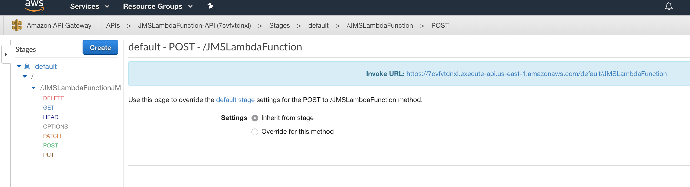

# Setting up the AWS Lambda function

## Getting started

Clone the github repo with the following command

``` bash
git clone https://github.com/ibm-messaging/mq-cloud-demo
```

Now we must download the dependencies for our two JMS applications.

Install Gradle following this guide - [Installing Gradle](https://docs.gradle.org/current/userguide/installation.html").

Run the following commands to grab the depencies:

```bash
# AWS Lambda JMS Application
cd mq-cloud-demo/aws-backend-request/JMSLambdaFunction
gradle getDeps

# IBM Backend Response JMS Application
cd mq-cloud-demo/ibm-backend-response/jmsapp
gradle getDeps
```

Check that the following files exist along with various other dependencies in the following directories:

```sh
---
ibm-backend-response/jmsapp/jars/com.ibm.mq.allclient-9.0.4.0.jar
ibm-backend-response/jmsapp/jars/javax.jms-api-2.0.1.jar
---
aws-backend-request/JMSLambdaFunction/jars/javax.jms-api-2.0.1.jar
aws-backend-request/JMSLambdaFunction/jars/com.ibm.mq.allclient-9.0.4.0.jar
---
```

Once confirmed you can now continue on with the next step of this guide.

Now you have configured both queue managers, we will now configure the backend JMS applications that will consume and produce messages.

## About

The first of the two applications will be triggered by a REST api, simulating a customer stock check request, and produce a message that will be handled by a backend response, which will return a stock count for a given product.

### 1. Build Steps

1. Build the deployment zip:

    ```bash
    cd mq-cloud-demo/aws-backend-request/JMSLambdaFunction
    gradle build
    ```

2. Confirm the zip has been created, it will be found in the following directory:

    - `mq-cloud-demo/aws-backend-request/JMSLambdaFunction/build/distributions`

### 2. Creating an AWS Lambda Function

1. Go to the [AWS Lambda Console](https://console.aws.amazon.com/lambda/home?region=us-east-1).

2. Click `Create Function`.

3. Select `Author from scratch`.

4. Name the function JMSLambdaFunction

5. Select `Java 8` from the Runtime dropdown.

6. Under role, select `Create a custom role`, you will be taken to a new page, leave the values as default and click `Allow`.

7. Now click `Create function` and wait for the process to complete, you will be redirected to the Lambda Function configuration page.

### 3. Deploy Function code

1. In the `Configuration` tab, select the function `JMSLambdaFunction` from the designer. Scroll down the page to the `Function code` sub-section.

2. In this section, paste the following into the `Handler` field.

    ```bash
    com.example.lambda.ibmmq.JMSLambda::handleRequest
    ```

3. Click upload, navigate to `mq-cloud-demo/aws-backend-request/JMSLambdaFunction/build/distributions` and select `JMSLambdaFunction.zip`.

4. Now click `Save` at the top right of the page.

### 4. Set Environment variables

For this step, you will require the connection information for the AWS queue manager that you would have downloaded earlier from section 1 of this guide (hint: look for aws.json).

You will also require the application details and api key, which was downloaded in section 1 (hint: look for app.json).

With your function still selected, below the "Function code" section, there is another box entitled "Environment variables".

Add the following key / value pairs as environment variables.

| Variable Name |  Value |
| ------------- | ------ |
| APP_PASSWORD | <Your_Application_APIKey>
| APP_USER | <Your_Application_MQUsername>
| QMGR_HOST | <The_Hostname_Of_Your_Queue_Manager>
| QMGR_PORT | <Your_QM_Port>
| QMGR_NAME | <Your_QMGR_NAME>
| RESPONSE_QUEUE_NAME | STOCK.REPLY
| TARGET_QUEUE_NAME | STOCK

___

#### Screenshot of configured Lambda Function


___

### 5. Create API Gateway

Now we will add an API Gateway which will allow us to invoke the function using a simple HTTP REST call.

1. In the `Configuration` tab, within the `Designer` sub-section, click `API Gateway` from the left hand column.

2. Once added, under `Configure triggers`, from the API dropdown select `Create a new API`.

3. Under `Security` choose Open.

4. Click `Add`, and then click `Save` in the top right hand corner of the page.

5. This will create a new API Gateway named `JMSLambdaFunction-API`

    - You will now see an API endpoint has been generated, take note of this as we will need it later.

6. Click the name for the API Gateway to access its dashboard to configure it.

### 6. Configure API Gateway

Now we must configure and deploy the API we have just created.

1. Now in the API Gateway dashboard, find your new API in the left-hand APIs navbar, select it and choose `Resources`

2. In the 'Resources' view, click 'Actions' and select 'Create Method'

3. In the dropdown presented on screen, select `POST` and click the checkmark button.

4. In the setup view, choose your function from the Lambda Function field, leave everything else as default, and click 'Save'.

5. Click 'Actions' and select 'Enable CORS'. This is nescessary to allow testing from locally hosted applications for example.

6. In the 'Enable CORS' page, leave defaults and click `Enable CORS and replace existing CORS headers`, when prompted click `Yes, replace existing values`.

7. Click 'Actions' and select 'Deploy API'. Select `default` for 'Deployment stage', add an option description and click `Deploy`.

The Lambda function is now ready to be invoked over REST, now let's configure the backend responder that will return the stock count.
___

#### Screenshot of fully configured API Gateway


___

## Copyright

© Copyright IBM Corporation 2018