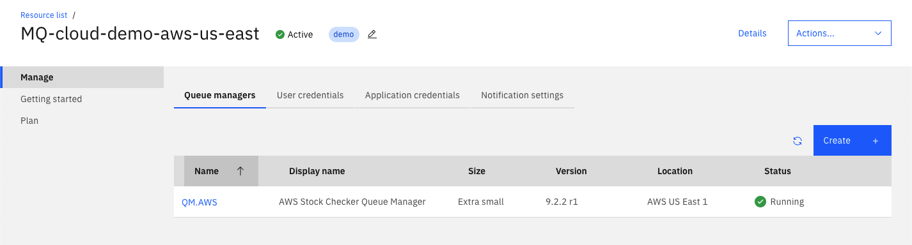

# Configuring two IBM MQ on Cloud queue managers

In this part of the guide we will deploy IBM MQ to two regions; IBM Cloud US South, and AWS EU West 1.

## 1. Create two IBM MQ service instance

Go to the [IBM MQ on Cloud catalog page](https://console.bluemix.net/catalog/services/mq).

Give the service the name 'MQ-cloud-demo-ibm'.

Choose 'London' from the 'Choose a region/location to deploy in:' dropdown to deploy in.

This will allow us to deploy a queue manager in 'IBM Cloud United Kingdom'.

Click 'Create'.

Once complete, go back to the [IBM MQ on Cloud catalog page](https://console.bluemix.net/catalog/services/mq).

Give the service the name 'MQ-cloud-demo-aws'.

Choose 'Dallas' from the 'Choose a region/location to deploy in:' dropdown to deploy in.

This will allow us to deploy a queue manager in 'AWS US East 1'.

Click 'Create'.

Go to the [dashboard](https://console.bluemix.net/dashboard/apps?search=mq-cloud-demo).

You should see two instances of IBM MQ running on IBM Cloud, in Dallas and London.

___ 

## 2. Deploy the queue managers

### 2.1 Deploy IBM Cloud queue manager

First, let's deploy a queue manager, to the 'MQ-cloud-demo-ibm' instance.

Go to the [dashboard](https://console.bluemix.net/dashboard/apps?search=mq-cloud-demo), and click 'MQ-cloud-demo-ibm' in the list view.

In the service instance, whilst on the 'Queue managers' tab click 'Create'.

Give this queue manager the name 'QM.IBM', and the display name 'IBM Cloud Stock Check queue manager'

Select 'IBM Cloud United Kingdom ' from the location dropdown.

Select 'Trial' as the queue manager size. This will be free to use for 30 days.

Now click 'Create'. You should now see the queue manager listed in the 'Queue managers' tab.

### 2.2 Deploy AWS queue manager

Whilst this is deploying, in a new tab Go back to the [dashboard](https://console.bluemix.net/dashboard/apps?search=mq-cloud-demo), and click 'MQ-cloud-demo-aws' in the list view.

In the service instance, from the the 'Queue managers' tab click 'Create'.

Give this queue manager the name 'QM.AWS', and the display name 'AWS Stock Check queue manager'

Select 'AWS US East 1' from the location dropdown.

You can only select from Small, Medium, or Large queue managers sizes for AWS deployments.
For this demo, choose 'Small'.

Click 'Create'. Now back in the queue manager list you should see 'QM.AWS' is deploying,and in your other tab, in the 'MQ-cloud-demo-ibm' you should see 'QM.IBM' is deploying also.

Wait a few minutes for both queue managers to finish deploying, once complete move onto creating application permissions.




___

## 3. Create Application Permissions

In order for an MQ application to connect to an instance of IBM MQ on Cloud, we must first create application user permissions in the service instance where we deployed our queue managers.

## 3.1 Create application permissions for IBM Cloud queue manager

Go to the [dashboard](https://console.bluemix.net/dashboard/apps?search=mq-cloud-demo), and click 'MQ-cloud-demo-ibm' in the list view.

Navigate to the 'Application Permissions' tab, and click 'Create'.

Give the application the name 'stockcheck-ibm', and the description 'IBM stock check application'.

Click 'Generate MQ username', this will be used in conjunction with an API Key to authenticate the applications with our queue managers.

Click 'Add and generate API key' to continue.

Wait a few moments whilst this action is performed.

In the subsequent dialog, click 'Download', this will save a copy of the API key to your computer in a `.json` file. Move this file `mq-cloud-demo/qm-config` and rename it `app-ibm.json`.

## 3.2 Create application permissions for AWS queue manager

Go to the [dashboard](https://console.bluemix.net/dashboard/apps?search=mq-cloud-demo), and click 'MQ-cloud-demo-aws' in the list view.

Navigate to the 'Application Permissions' tab, and click 'Create'.

Give the application the name 'stockcheck-aws', and the description 'AWS stock check application'.

Click 'Generate MQ username', this will be used in conjunction with an API Key to authenticate the applications with our queue managers.

Click 'Add and generate API key' to continue.

Wait a few moments whilst this action is performed.

In the subsequent dialog, click 'Download', this will save a copy of the API key to your computer in a `.json` file. Move this file `mq-cloud-demo/qm-config` and rename it `app-aws.json`.

___

## 4. Download Connection Info for both queue managers

Go to the [dashboard](https://console.bluemix.net/dashboard/apps?search=mq-cloud-demo), and click 'MQ-cloud-demo-aws' in the list view.

Go to the 'Queue managers' tab.

Click on actions menu for 'QM.AWS' and click 'Download connection info (JSON)'.

This will download the connection info in json format for this queue manager, including hostname, port number, queue manager name. This information will be used to configure the two JMS applications later.

Do the same for your IBM Cloud queue manager 'QM.IBM'.

Go to the [dashboard](https://console.bluemix.net/dashboard/apps?search=mq-cloud-demo), and click 'MQ-cloud-demo-ibm' in the list view.

Go to the 'Queue managers' tab.

Click on actions menu for 'QM.IBM' and click 'Download connection info (JSON)'.

Move both of these files to `mq-cloud-demo/qm-config` and rename them `info-aws.json` and `info-ibm.json` accordingly.

```bash
mq-cloud-demo
|
|- /qm-config
    |- info-aws.json // QM.AWS connection info
    |- info-ibm.json // QM.IBM connection info
```

___

## 5. Create admin user permissions

### 5.1 Add user permissions to IBM Cloud queue manager

Go to the [dashboard](https://console.bluemix.net/dashboard/apps?search=mq-cloud-demo), and click 'MQ-cloud-demo-ibm' in the list view.

Navigate to the 'User permissions' tab.

Click `Add permissions`.

Enter the email address for your IBM Cloud account.

Click `Generate MQ username`.

This will generate your unique MQ username, do not edit this.

Click `Add permissions` to continue, once complete you will be navigated back to the 'User permissions' view.

### 5.2 Add user permissions to IBM Cloud queue manager

Go to the [dashboard](https://console.bluemix.net/dashboard/apps?search=mq-cloud-demo), and click 'MQ-cloud-demo-aws' in the list view.

Navigate to the 'User permissions' tab.

Click `Add permissions`.

Enter the email address for your IBM Cloud account.

Click `Generate MQ username`.

This will generate your unique MQ username, do not edit this.

Click `Add permissions` to continue, once complete you will be navigated back to the 'User permissions' view.

### 5.3 Download api key

Next, we must generate an MQ username and API key which will allow you to use the MQ Console and administer the queue manager using the administrative REST api or other methods (e.g. MQ Explorer, runmqsc).

Go to the [dashboard](https://console.bluemix.net/dashboard/apps?search=mq-cloud-demo), and click 'MQ-cloud-demo-aws' in the list view. This api key is tied to the IBM Cloud platform, so we can download it once an reuse for both queue managers.

Click on 'QM.AWS' in the 'Queue managers' tab. This will take you to the details view for this queue manager.

From here, click on the 'Administration' tab. We will now generate you an MQ username, and check whether you have an existing MQ on Cloud api key, or an existing IBM Cloud platform API key.

If you do not already have an existing API key for IBM Cloud, click the 'Create/Reset IBM Cloud API Key' button.

Download the api key file from the subsequent dialog, and move this file to `mq-cloud-demo/qm-config` and rename it to `user.json`.

___

## 6. Configuring the queue managers

We have included a handy script that will configure both queue managers using the supplied connection info files, application details and admin user details.

You should have the following files in the `mq-cloud-demo/qm-config` directory;

```bash
mq-cloud-demo
|
|- /qm-config
    |- info-aws.json
    |- info-ibm.json
    |- app-ibm.json
    |- app-aws.json
    |- user.json
    |- configure_qmgr.sh
```

Run the following script passing in the following parameters.

```bash
cd mq-cloud-demo/qm-config
./configure_qmgr.sh info-ibm.json app-ibm.json info-aws.json app-aws.json user.json
```

Greate, you have enabled messaging between two IBM MQ on Cloud queue managers. Return to the main README page to continue the guide -> [Go Back](../README.md#setting-up-the-aws-lambda-function)