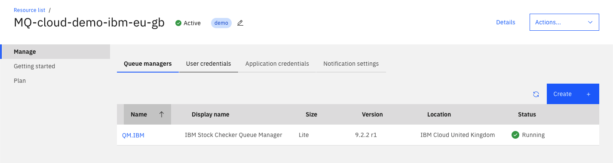

# Configuring two IBM MQ on Cloud queue managers

In this part of the guide we will deploy IBM MQ to two regions; IBM Cloud US South, and AWS EU West 1.

## 1. Create two IBM MQ service instance

Go to the [IBM MQ on Cloud catalog page](https://cloud.ibm.com/catalog/services/mq).


Choose 'London (eu-gb)' from the 'Select a location' dropdown.

Choose the Lite plan for this region. 

Name the service 'MQ-cloud-demo-ibm-eu-gb'.

This will allow us to deploy a queue manager in MQ on Cloud deployment region named 'IBM Cloud United Kingdom'.

Click 'Create'.

Once complete, go back to the [IBM MQ on Cloud catalog page](https://cloud.ibm.com/catalog/services/mq).

Choose 'Dallas (us-south)' from the 'Select a location' dropdown.

Choose the Default plan for this region. AWS deployments are not supported in lite plan.

Give the service the name 'MQ-cloud-demo-aws-us-east'.

This will allow us to deploy a queue manager in the MQ on Cloud deployment region named 'AWS US East 1'.

Click 'Create'.

Go to the [resource list](https://cloud.ibm.com/resources?search=mq-cloud-demo).

Under the services section in the resource list you should see two instances of IBM MQ running on IBM Cloud, in Dallas and London.

___ 

## 2. Deploy the queue managers

### 2.1 Deploy IBM Cloud queue manager

First, let's deploy a queue manager, to the 'MQ-cloud-demo-ibm-eu-gb' instance.

Go to the [resource list](https://cloud.ibm.com/resources?search=mq-cloud-demo), and click 'MQ-cloud-demo-ibm-eu-gb' in the list view.

In the service instance, whilst on the 'Queue managers' tab click 'Create'.

Give this queue manager the name 'QM.IBM', and the display name 'IBM Cloud Stock Check queue manager'

Select 'IBM Cloud United Kingdom' from the location dropdown.

The 'Lite' queue manager size should already be selected.

Now click 'Create'. You should now see the queue manager listed in the 'Queue managers' tab.

### 2.2 Deploy AWS queue manager

Whilst this is deploying, in a new tab Go back to the [resource list](https://cloud.ibm.com/resources?search=mq-cloud-demo), and click 'MQ-cloud-demo-aws-us-east' in the list view.

In the service instance, from the the 'Queue managers' tab click 'Create'.

Give this queue manager the name 'QM.AWS', and the display name 'AWS Stock Check queue manager'

Select 'AWS US East 1' from the location dropdown.

For this demo set the queue manager size to 'Extra Small'.

Click 'Create'. Now back in the queue manager list you should see 'QM.AWS' is deploying,and in your other tab, in the 'MQ-cloud-demo-ibm-eu-gb' service instance you should see 'QM.IBM' is deploying also.

Wait a few minutes for both queue managers to finish deploying, once complete move onto creating application permissions.

 


___

## 3. Create Application Permissions

In order for an MQ application to connect to an instance of IBM MQ on Cloud, we must first create application user permissions in the service instance where we deployed our queue managers.

## 3.1 Create application permissions for IBM Cloud queue manager

Go to the [resource list](https://cloud.ibm.com/resources?search=mq-cloud-demo), and click 'MQ-cloud-demo-ibm-eu-gb' in the list view.

Navigate to the 'Application credentials' tab, and click 'Create'.

Give the application the name 'ibm-stock, and the description 'IBM stock check application'.

The application username will be automatically generated from the application credential name as 'ibmstock'

Click 'Add and generate API key' to continue.

Wait a few moments whilst this action is performed.

In the subsequent dialog, click 'Download', this will save a copy of the API key to your computer in a `.json` file. Move this file to the project directory and into `mq-cloud-demo/qm-config`, then rename it `app-ibm.json`.

## 3.2 Create application permissions for AWS queue manager

Go to the [resource list](https://cloud.ibm.com/resources?search=mq-cloud-demo), and click 'MQ-cloud-demo-aws-us-east' in the list view.

Navigate to the 'Application credentials' tab, and click 'Create'.

Give the application the name 'aws-stock, and the description 'AWS stock check application'.

The application username will be automatically generated from the application credential name as 'awsstock'

Click 'Add and generate API key' to continue.

Wait a few moments whilst this action is performed.

In the subsequent dialog, click 'Download', this will save a copy of the API key to your computer in a `.json` file. Move this file to the project directory and into `mq-cloud-demo/qm-config`, then rename it `app-aws.json`.

Now you should have two application credentials json files in the mq-cloud-demo directory

```bash
mq-cloud-demo
|
|- /qm-config
    |- app-aws.json // QM.AWS connection info
    |- app-ibm.json // QM.IBM connection info
```
___

## 4. Download Connection Info for both queue managers

In the 'MQ-cloud-demo-aws-us-east' service instance, go to the 'Queue managers' tab.

Hover on the table row for 'QM.AWS' and click the three dot menu icon, and then click 'Download connection info (JSON)'.

This will download the connection info in json format for this queue manager, including hostname, port number, queue manager name. This information will be used to configure the two JMS applications later.

Do the same for your IBM Cloud queue manager 'QM.IBM'.

In the 'MQ-cloud-demo-ibm-eu-gb' service instance, go to the 'Queue managers' tab.

Hover on the table row for 'QM.IBM' and click the three dot menu icon, and then click 'Download connection info (JSON)'.

Move both of these files to `mq-cloud-demo/qm-config` and rename them `info-aws.json` and `info-ibm.json` accordingly.

```bash
mq-cloud-demo
|
|- /qm-config
    ...
    |- info-aws.json // QM.AWS connection info
    |- info-ibm.json // QM.IBM connection info
```

___

## 5. Get admin user credentials

Admin user permissions are automatically added to your queue manager when you first created it. To retrieve the api key and details for the admin user for your queue managers, follow these instructions.  This api key is tied to the IBM Cloud platform, so we can download it once an reuse for both queue managers.

Go to the [resource list](https://cloud.ibm.com/resources?search=mq-cloud-demo), and click 'MQ-cloud-demo-ibm-eu-gb' in the list view.
Click on 'QM.IBM' in the 'Queue managers' tab. This will take you to the details view for this queue manager.

From here, click on the 'Administration' tab. You will now see three buttons which will switch between three views; MQ Console, MQ Explorer, and runmqsc. For now select runmqsc, and then click the 'Create/Reset IBM Cloud API Key button' (text will differ depending on whether you have previously created an API key using this service).

Download the api key file from the subsequent dialog, and move this file to `mq-cloud-demo/qm-config` and rename it to `admin-user.json`.

___

## 6. Downloading public certificates for queue managers

As of the release for version 9.2.2 revision 1 of the MQ on Cloud queue manager, TLS has been enabled by default to ensure a higher standard of security for all users. This means that an additional step of configuring the client applications to use a keystore with trusted public certificates from the queue manager is required. 

## 6.1 Obtaining the public certificate for the IBM queue manager

Firstly we will download the public certificate for the IBM queue manager 'QM.IBM'.

Go to the [resource list](https://cloud.ibm.com/resources?search=mq-cloud-demo), and click 'MQ-cloud-demo-ibm-eu-gb' in the list view.
Click on 'QM.IBM' in the 'Queue managers' tab. This will take you to the details view for this queue manager.

Next, click on the 'Key store' tab and then click the three dot menu on the certificate labeled 'Default: qmgrcert'. 

In this menu, click the 'Download public certificate' button. This will download a file names `qmgrcert.pem`. Move this to your project directory and into the `ibm-backend-response` internal directory, and place it in the java project filepath.

```
mq-cloud-demo/ibm-backend-response/jmsapp/qmgrcert.pem
```

## 6.2 Obtaining the public certificate for the AWS queue manager

Firstly we will download the public certificate for the IBM queue manager 'QM.IBM'.

Go to the [resource list](https://cloud.ibm.com/resources?search=mq-cloud-demo), and click 'MQ-cloud-demo-aws-us-east' in the list view.
Click on 'QM.AWS' in the 'Queue managers' tab. This will take you to the details view for this queue manager.

Next, click on the 'Key store' tab and then click the three dot menu on the certificate labeled 'Default: qmgrcert'. 

In this menu, click the 'Download public certificate' button. This will download a file names `qmgrcert.pem`. Move this to your project directory and into the `aws-backend-request` internal directory, and place it in the java project filepath.

```
mq-cloud-demo/aws-backend-request/JMSLambdaFunction/qmgrcert.pem
```

We will configure keystores in each individual applications setup instructions which will follow later in this guide.

## 7. Configuring the queue managers

We have included a handy script that will configure both queue managers using the supplied connection info files, application details and admin user details.

You should have the following files in the `mq-cloud-demo/qm-config` directory;

```bash
mq-cloud-demo
|
|- /qm-config
    |- info-aws.json
    |- info-ibm.json
    |- app-ibm.json
    |- app-aws.json
    |- admin-user.json
    |- configure_qmgr.sh
```

As the script expects files to be named in a specifc way please ensure this is correct before continuing.

Run the following script passing in the following parameters.

```bash
cd mq-cloud-demo/qm-config
./configure_qmgr.sh info-ibm.json app-ibm.json info-aws.json app-aws.json admin-user.json
```

Greate, you have enabled messaging between two IBM MQ on Cloud queue managers. Return to the main README page to continue the guide -> [Go Back](../README.md#setting-up-the-aws-lambda-function)

## Copyright

© Copyright IBM Corporation 2018, 2021
