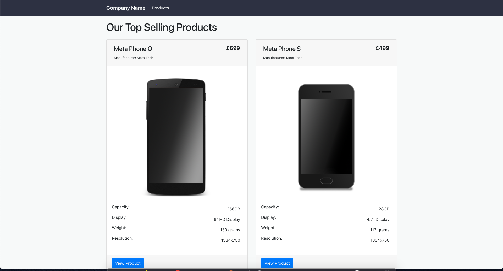
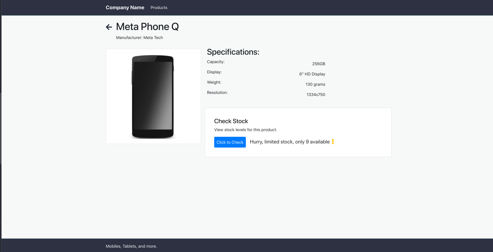

# Cross Cloud Stock Check Web Application

## Initial Setup

``` bash
# change directories to the UI project
cd mq-cloud-demo/ui

# install dependencies
npm install

# serve with hot reload at localhost:8080
npm run dev
```

For a detailed explanation on how things work, check out the [guide](http://vuejs-templates.github.io/webpack/) and [docs for vue-loader](http://vuejs.github.io/vue-loader).

## Setup LAMBDA_URL

In the file 'mq-cloud-demo/ui/src/globals.js' set `LAMBDA_URL` to the hostname for your API Gateway setup in step 2.5 of this guide.

```javascript
// for example
LAMBDA_URL: 'https://0a9s7gpaos.execute-api.us-east-1.amazonaws.com/default/JMSLambdaFunction'
```

## Deploying Static Assets on Amazon S3

To build the project, run the following command:

``` bash
# build for production with minification
npm run build
```

This will generate a directory containing static assets, which can be hosted on Amazon S3.

```bash
- dist
  |- index.html
  |- static
    |- css
    |- img
    |- js
```

First, let's create a new S3 Bucket on AWS.

- Navigate to https://s3.console.aws.amazon.com/
- Create a new bucket, give it the name 'mq-cloud-demo' and click 'Next'.
- In the step 'Configure options' leave settings as default and click 'Next'.
- In the step 'Set permissions' un-check all values, and then click 'Next'.
- Review your bucket settings and click `Create Bucket`.

Now lets configure the bucket to host our static web application

- Navigate to https://s3.console.aws.amazon.com/
- Click 'mq-cloud-demo' to open the bucket
- In the top tabs, open 'Properties'
- Click 'Static website hosting'
- Select 'Use this bucket to host a website', set index document to `index.html` and click 'Save'.
- Now go to 'Permissions' from the top tabs.
- Click 'Bucket Policy'.
- In the text field paste the following json. This will enable public read / GET object access to the bucket. Click 'Save'.

  ```json
  {
    "Version": "2012-10-17",
    "Statement": [
        {
            "Sid": "PublicReadGetObject",
            "Effect": "Allow",
            "Principal": "*",
            "Action": "s3:GetObject",
            "Resource": "arn:aws:s3:::mq-cloud-demo/*"
        }
    ]
  }
  ```

Now we can uplaod the files we built earlier on.

- Navigate to https://s3.console.aws.amazon.com/
- Click 'mq-cloud-demo' to open the bucket
- Click upload
- In the upload dialog drag and drop the contents of the dist folder into the dialog to initiate the upload.
  - You can do this by selecting both the folder `static` and the `index.html` file and dragging into the browser window and dropping them onto the upload dialog.
- Check both sets of files are listed, and click `Upload`.
- Now, go to 'Properties' and click 'Static website hosting'
- Click the link next to 'Endpoint', this is the URL for your statically hosted web app.

In the web application, click one of the products shown on screen.

In the product page press 'Click to Check' button.

This will send a 'POST' to the Lambda Function, and return a response from the backend JMS application. After a few moments you should be presented with a response showing how many products are available.

Great, you have now configured a full end to end scenario to demonstrate secure, reliable transmissions of data across multiple regions and cloud providers - for example IBM MQ on IBM Cloud in the UK and IBM MQ on AWS in the US.
___

### Screenshots of deployed web application



___

## Copyright

© Copyright IBM Corporation 2018
